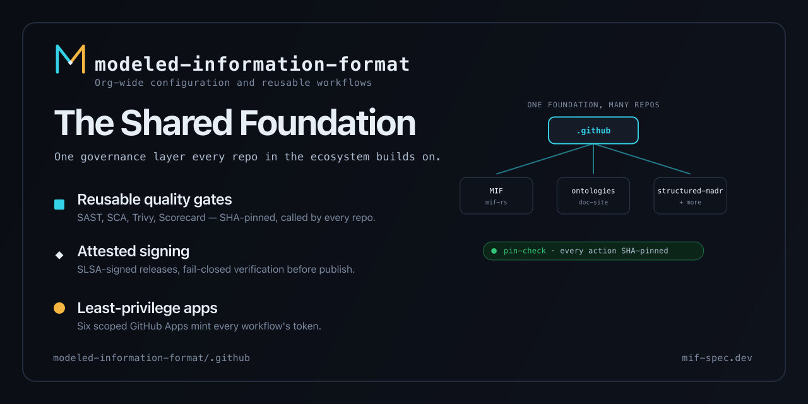

# `.github` — modeled-information-format org configuration

<p align="center">
  
</p>

Org-wide community-health defaults, reusable attested quality-gate workflows,
and the centralized signing/verification workflows for the **modeled-information-format**
organization.

[](docs/adr/ADR-011-least-privilege-app-fleet.md)
[](auth/apps.json)
[](docs/onboarding/app/five-app-provisioning.md)
[](docs/onboarding/app/five-app-provisioning.md)
[](docs/onboarding/app/five-app-provisioning.md)
[](docs/onboarding/app/five-app-provisioning.md)
[](docs/onboarding/app/five-app-provisioning.md)
[](docs/onboarding/app/five-app-provisioning.md)

## GitHub Actions policy

Org → Settings → Actions → General. The org runs a **fail-closed, SHA-pinned**
Actions posture:

- ☑ **Allow <org>, and select non-<org>, actions and reusable workflows**
- ☑ Allow actions created by **GitHub** (covers every `actions/*` and `github/*`)
- ☑ Allow actions by **Marketplace verified creators**
- ☑ **Require actions to be pinned to a full-length commit SHA** — foundational;
  never disable. Enforced transitively, and independently re-checked per-repo by
  the `pin-check` job. (This is why workflows must avoid composite actions that
  hide tag-pinned nested actions, e.g. `actions/upload-pages-artifact` →
  `actions/upload-artifact@v4`; package such steps inline with SHA-pinned actions.)

Same-org (`modeled-information-format/*`) and GitHub-created (`actions/*`, `github/*`)
actions are always allowed. Everything else is a third-party publisher that must
be added to the **"Allow specified actions and reusable workflows"** box.

### Allowed third-party actions (deduped)

`docker/*` subsumes the individual `docker/...` actions, so they are not listed
separately.

```
anchore/sbom-action@*,modeled-information-format/*,codecov/codecov-action@*,crate-ci/typos@*,dependabot/fetch-metadata@*,docker/*,dtolnay/rust-toolchain@*,gitleaks/gitleaks-action@*,google/osv-scanner-action/*,peter-evans/dockerhub-description@*,rust-lang/crates-io-auth-action@*,softprops/action-gh-release@*,taiki-e/install-action@*
```

| Pattern | Used by |
| --- | --- |
| `anchore/sbom-action@*` | SBOM generation (Syft) |
| `modeled-information-format/*` | org-owned actions/reusables (always allowed; explicit here) |
| `codecov/codecov-action@*` | coverage upload |
| `crate-ci/typos@*` | spell check |
| `dependabot/fetch-metadata@*` | dependabot automation |
| `docker/*` | buildx, login, metadata, setup-qemu, build-push, dockerhub-description (build chain) |
| `dtolnay/rust-toolchain@*` | Rust toolchain install |
| `gitleaks/gitleaks-action@*` | secret scanning (needs `GITLEAKS_LICENSE` secret) |
| `google/osv-scanner-action/*` | SCA (`reusable-sca-osv` runs the `osv-scanner-action` + `osv-reporter-action` **subpath** actions inline; the trailing `/*` is required — `google/osv-scanner-action@*` does not match subpath actions and makes any caller startup-fail) |
| `peter-evans/dockerhub-description@*` | Docker Hub README sync |
| `rust-lang/crates-io-auth-action@*` | crates.io Trusted Publishing |
| `softprops/action-gh-release@*` | GitHub Release creation (rust-template) |
| `taiki-e/install-action@*` | cargo tool install (cargo-audit, etc.) |

### Referenced by workflows but NOT in the list above — add before enabling those gates

These appear in org reusable/template workflows. Until added, any workflow that
reaches them will **startup-fail** ("workflow file issue"):

| Pattern | Gate / workflow | Notes |
| --- | --- | --- |
| `aquasecurity/trivy-action@*` | `reusable-trivy` (IaC/license) | **Release-critical** — rust-template's `release.yml` calls this gate; the release will fail without it. |
| `ossf/scorecard-action@*` | `reusable-scorecard` | posture |
| `grafana/run-k6-action@*`, `grafana/setup-k6-action@*` | `reusable-k6` | load testing |
| `zaproxy/action-full-scan@*` | `reusable-zap` | DAST |
| `redhat-plumbers-in-action/differential-shellcheck@*` | `reusable-shellcheck` | hook SAST → SARIF (plugin marketplace) |
| `sigstore/cosign-installer@*` | `sign-and-attest`, `reusable-cosign-sign` | container signing (SLSA L3) + keyless blob/catalog signing |
| `aws-actions/amazon-ecr-login@*`, `aws-actions/configure-aws-credentials@*` | `pipeline` deploy | ECR (only when `publish` is enabled) |
| `anchore/scan-action@*` | image scan | grype |

> **Allow-list-free reusable:** `reusable-checkov.yml` (IaC policy gate) installs
> Checkov via `pip` and uses only GitHub-created actions, so it references **no**
> third-party action and needs **no** allow-list entry — callers run it as-is.

Complete superset (every third-party action across all org workflows):

```
anchore/sbom-action@*,anchore/scan-action@*,aquasecurity/trivy-action@*,aws-actions/amazon-ecr-login@*,aws-actions/configure-aws-credentials@*,codecov/codecov-action@*,crate-ci/typos@*,dependabot/fetch-metadata@*,docker/*,dtolnay/rust-toolchain@*,gitleaks/gitleaks-action@*,google/osv-scanner-action/*,grafana/run-k6-action@*,grafana/setup-k6-action@*,ossf/scorecard-action@*,peter-evans/dockerhub-description@*,rust-lang/crates-io-auth-action@*,sigstore/cosign-installer@*,softprops/action-gh-release@*,taiki-e/install-action@*,zaproxy/action-full-scan@*
```

> Regenerate this list after adding/removing actions:
> `grep -rhoE "[A-Za-z0-9][A-Za-z0-9_.-]+/[A-Za-z0-9][A-Za-z0-9_./-]+@[0-9a-f]{40}" <repo>/.github/workflows | sed -E 's#@[0-9a-f]{40}$##; s#^([^/]+/[^/]+)(/.*)?$#\1#' | sort -u`
